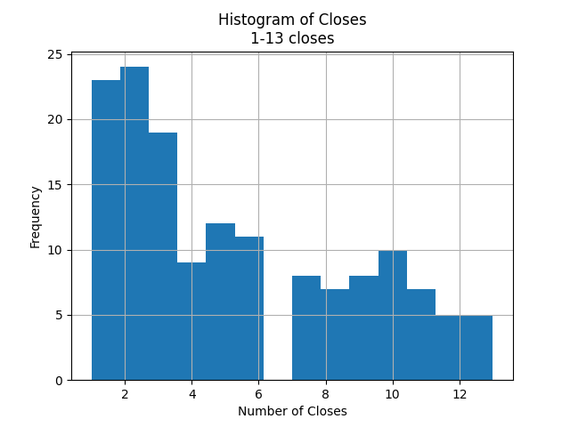
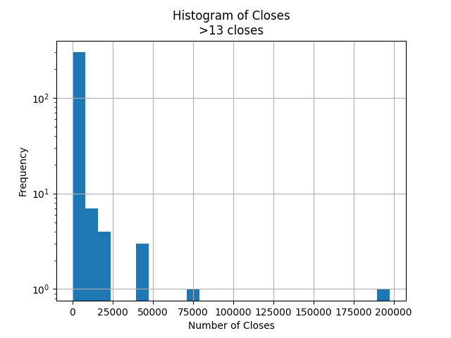
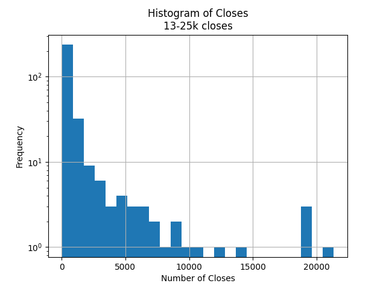

# Console Application Usage Analysis

The data are entries of when applications were closed. This limits the characteristics of the conclusions.

## Results

### Summary statistics

```
count      1258.000000
mean        595.641494
std        6458.652590
min           0.000000
25%           0.000000
50%           0.000000
75%          13.750000
max      197703.000000
```





### Interesting observations

Open counts for parameter page

```
PA0052 non-mcr       111199
       mcr            86505
```

## Conclusions

### Outliers

The _General Purpose Parameter Program_ (PA0052) with 197,703 closes in 2 years is a clearly valuable application. It stands as an outlier with the next most closed program (PA1661) having 72,746 closes.

There are 795 applications, 63% of the 1258 total, that have not been closed in the past two years. These applications should be archived to reduce the maintenance load and allow Controls to focus efforts on critical applications.

### Consolidation opportunities

There are two plotting applications in the top five of close counts. PA1516 and SA1002 both plot data. Consolidating these programs could increase the value of both and limit duplicated code and effort. Assuming we can add the close counts of these two, the consolidated version would be the second most closed program.

### Others

TODO

## Reproduction

The conclusions in this readme are based on the data and charts in the [results](results/) folder. With access to data source these data can be regenerated.

### Procedure

1. `./get_data.sh`
1. `python files_to_pkl.py`
1. `python gen_hist.py`

## Outstanding questions

- What are the cost of these applications?
  - cost vs use count could show a value estimate
- How many users are using each program?
- What is the number of average users per application?
- What applications fall on either side of avgerage users per application?
  - Control for times opened vs. number of users
- Horizontal is n_users and vertical is n_times_opened
  - That trend (fitted) is what will control for usage by application across variable users/app
